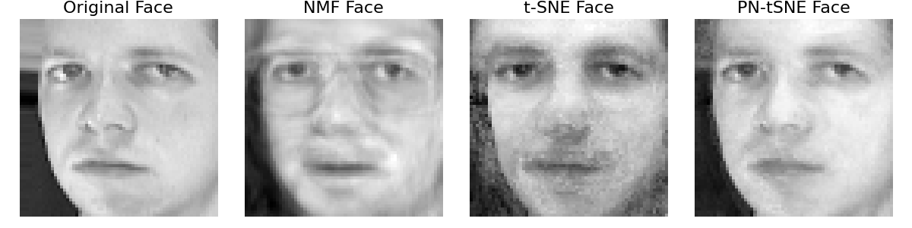
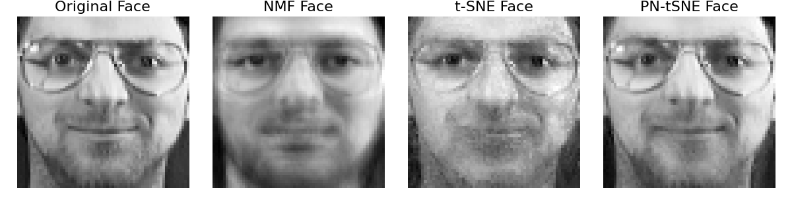
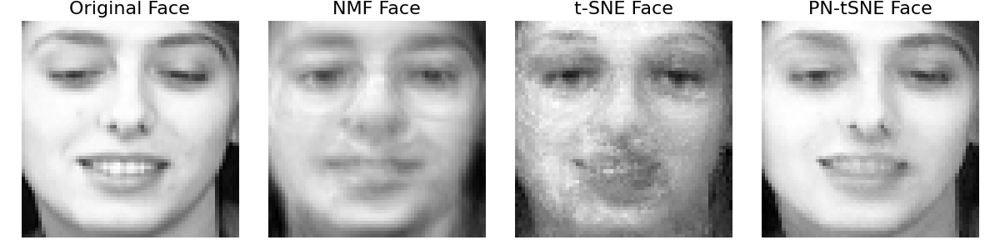
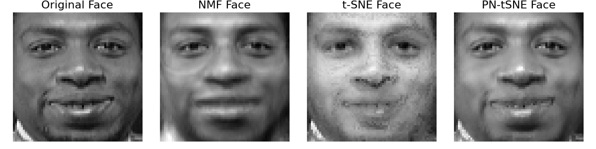
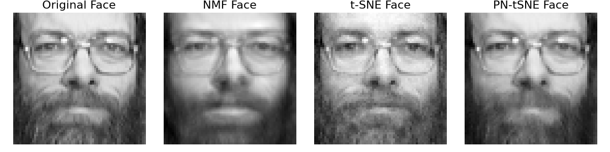

# SN-tSNE: Semi-Non-Negative t-SNE

PSN-tSNE is an enhanced version of the t-SNE algorithm that introduces a novel multiplicative update rule to enforce semi-non-negativity. This approach improves interpretability, convergence speed, and clustering performance compared to traditional t-SNE and related techniques.

## Key Features
- Enforces semi-non-negativity in the embedded space.
- Accelerates convergence with fewer iterations.
- Produces superior clustering performance on various datasets.

## Visual Overview
The figure below illustrates the comparison of PN-tSNE's convergence speed against other embedding techniques.

*Figure: Visualization of Olivetti face samples reconstructed from NMF, t-SNE, and SN-tSNE embeddings.*
